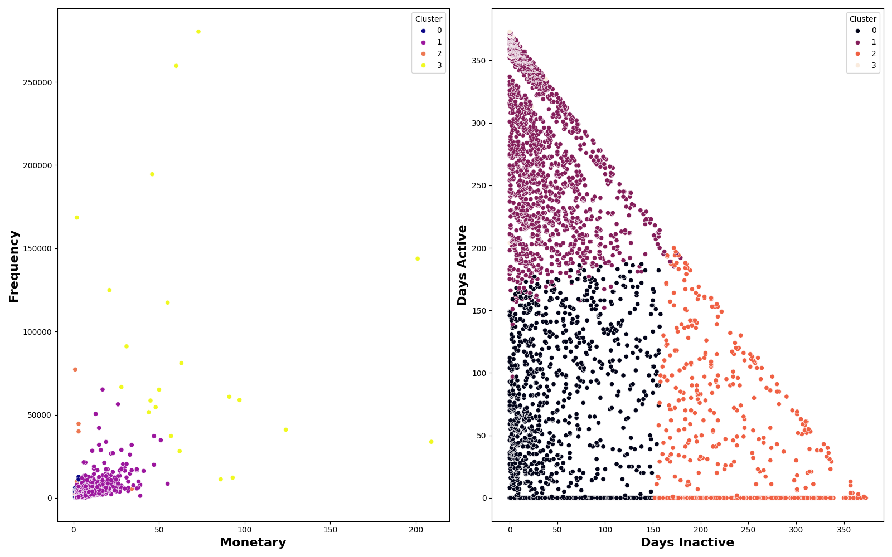
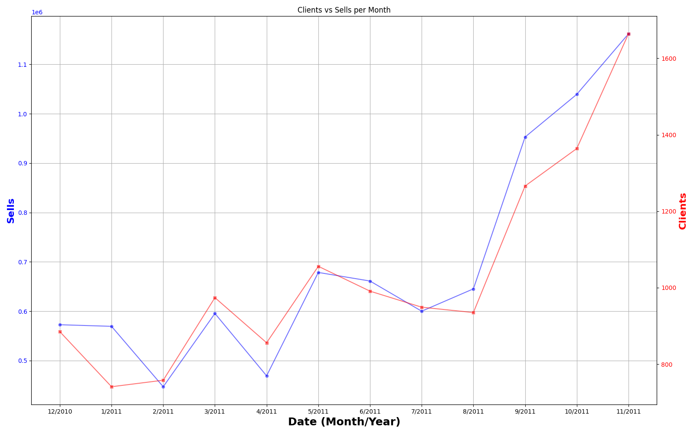

# 🛒 E-Commerce Analytics: Customer Segmentation & Recommendation System

## 📌 Context & Background
**This project is an adapted version of a commercial solution I originally developed for a freelance client in the retail sector.** While the proprietary data and specific business rules have been removed to comply with NDA, the **architectural logic, analytical pipeline, and algorithmic approach** mirror the production environment. I have adapted the code to run on a public dataset (~540,000 transaction records) to demonstrate how I solve real-world business problems-specifically optimizing marketing spend through segmentation and increasing average order value (AOV) via cross-selling analysis.

---

## 💼 Business Goal
The primary objective is to transform raw transactional logs into actionable business insights. The analysis focuses on two key areas:
1.  **Customer Retention:** Identifying distinct customer groups (VIPs, At-Risk, New) to tailor marketing communication.
2.  **Cross-Selling:** Discovering product associations to build a "Frequently Bought Together" recommendation engine.

---

## 🛠 Tech Stack
* **Data Storage:** SQLite (simulating a Data Warehouse environment).
* **ETL & Manipulation:** Python, Pandas, NumPy.
* **Machine Learning:** Scikit-learn (K-Means Clustering), Mlxtend (FP-Growth, Association Rules).
* **Visualization:** Seaborn, Matplotlib.

---

## 📊 Key Features & Methodology

### 1. SQL-Based ETL Pipeline
Instead of processing everything in-memory, raw CSV data (500k+ rows) is loaded into a **SQLite database**. Data cleaning, type casting, and initial aggregations are performed via complex SQL queries to simulate a scalable data engineering workflow.

### 2. Customer Segmentation (RFM + K-Means)
I implemented **RFM Analysis** (Recency, Frequency, Monetary) to quantify customer behavior. 
* **Standardization:** Data was normalized using `StandardScaler`.
* **Clustering:** Applied **K-Means** to group customers into 4 distinct clusters.

> **Insight Example:** > * *Cluster 3 (Loyalists):* High frequency, recent activity. Strategy: Loyalty programs.
> * *Cluster 1 (At-Risk):* High historical spend but high inactivity days. Strategy: Re-engagement campaigns.

### 3. Market Basket Analysis (Association Rules)
Used the **FP-Growth algorithm** to mine frequent itemsets and generate association rules.
* **Metric:** Lift & Confidence.
* **Outcome:** Identified strong relationships between items.

---

## 📈 Visualizations
*(Note: Add your screenshots here. For example:)*

| Segmentation Clusters | Sales Trend Analysis |
|:---------------------:|:--------------------:|
|  |  |
| *Visualizing customer groups based on Frequency vs. Monetary value* | *Monthly sales volume and active client growth* |
